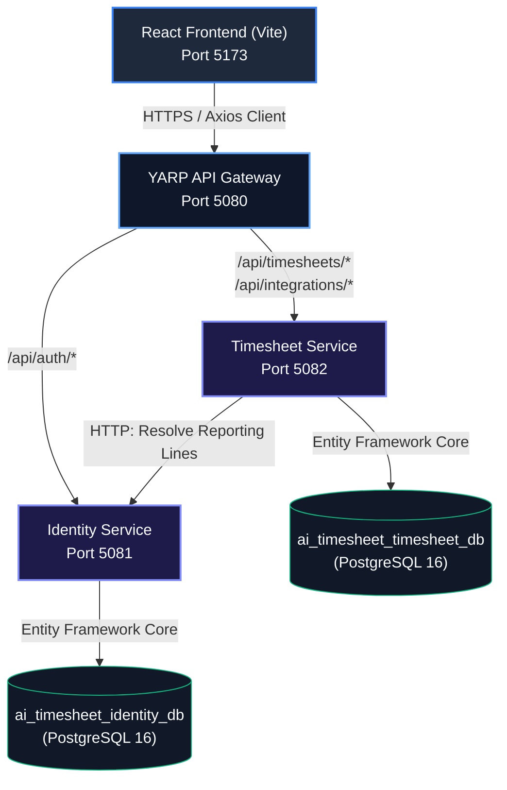

# AI Timesheet Generator

An AI-powered timesheet generator refactored into a high-performance **Microservices Architecture** with **Repository Pattern**, **Dependency Injection**, **JWT Authentication**, and a stunning **Glassmorphic Space-Dark UI**.

```
Employees login -> Gateway routes -> Identity Services issue JWT ->
Timesheet Service validates JWT -> Pulls tool activity & aggregates via AI fallback ->
Manager reviews & approves -> Stored securely in isolated PostgreSQL databases.
```

---

## 🏗️ High-Level Architecture

The system is separated into autonomous services communicating over secure HTTP, utilizing a YARP API Gateway as the single ingress point, with decentralized data storage.



---

## 🔒 Configuration & Security Mappings

### Port Layouts
- **React Frontend**: `http://localhost:5173`
- **YARP API Gateway**: `http://localhost:5080` (All API requests go here)
- **Identity Service**: `http://localhost:5081` (Internal & Auth routes)
- **Timesheet Service**: `http://localhost:5082` (Timesheet processing engine)
- **PostgreSQL**: `localhost:5432`

### JWT Security Configuration
The services share the following credentials for token signing and validation (configured in `appsettings.json` for both services):
- **Issuer**: `MyApi`
- **Audience**: `MyClient`
- **Security Key**: `ThisIsMyVerySecretKey123456789012345`

### Pre-Created Demo Accounts
Log in directly using the name and email combinations below (SSO / Azure Ad mock client):
* **Priya Sharma** (Employee)
  * **Email**: `priya@company.com`
  * **Role**: `Employee`
  * **Flow**: Generates AI timesheets from integrated mock tools (commits, Jira, etc.) and submits them for approval.
* **Sarah Jenkins** (Manager)
  * **Email**: `sarah@company.com`
  * **Role**: `Manager`
  * **Flow**: Accesses the Analytics and Approval panel to review, reject, or approve Priya's submitted timesheets.

---

## 🚀 Setup & Execution

### Prerequisites
- [.NET 8 SDK](https://dotnet.microsoft.com/download)
- [Node.js 18+](https://nodejs.org)
- [PostgreSQL 15+](https://www.postgresql.org/download/) (or use Docker)

### 1. Database Initialization

You can boot up PostgreSQL using the provided `docker-compose.yml` which configures isolated databases and runs the schema initialization script:

```bash
docker-compose up -d
```

*Note: If you run PostgreSQL locally on host, the services will automatically connect to it on port `5432`, create `ai_timesheet_identity_db` and `ai_timesheet_timesheet_db`, and auto-apply all entity migrations on boot.*

### 2. Run the Backend Microservices

Launch the three services concurrently:

```bash
# Terminal 1: Identity Service
dotnet run --project backend/AITimesheet.IdentityService

# Terminal 2: Timesheet Service
dotnet run --project backend/AITimesheet.TimesheetService

# Terminal 3: API Gateway
dotnet run --project backend/AITimesheet.Gateway
```

### 3. Run the Frontend

```bash
cd frontend
npm install
cp .env.example .env
npm run dev
```

Visit `http://localhost:5173` to interact with the application.

---

## 🎨 Tech Stack
* **Frontend**: React 18, TypeScript, Vite, Axios, Chart.js.
* **Gateway**: YARP (Yet Another Reverse Proxy).
* **Backend Services**: ASP.NET Core 8 Web API, Repository & Unit of Work patterns, Dependency Injection.
* **Database**: PostgreSQL 16 via EF Core & Npgsql.
* **AI engine**: Rule-based mock engine with Azure OpenAI GPT-4o configuration hooks.
